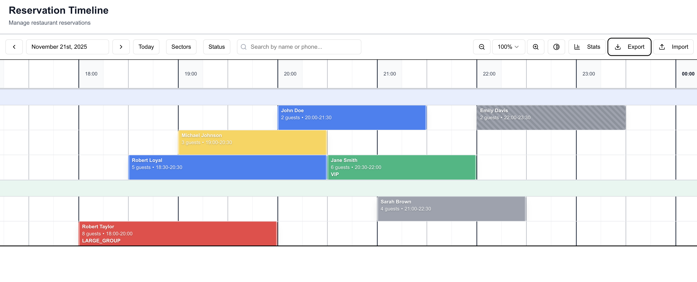

# Reservation Timeline

A modern, high-performance restaurant reservation management system built with Next.js, React, and TypeScript. Features an interactive timeline view for managing table reservations with drag-and-drop, real-time conflict detection, and comprehensive accessibility support.

🌐 **[Live Demo](https://reservation-timeline-chi.vercel.app/)** - Try it now!

## Features

- 📅 **Interactive Timeline View** - Visual grid-based timeline for managing reservations
- 🧪 **Comprehensive Testing** - Full test coverage with Vitest and Testing Library
- 🖱️ **Drag & Drop** - Move reservations between tables and time slots
- 🔄 **Resize Reservations** - Adjust duration by dragging reservation edges
- ⚠️ **Real-time Conflict Detection** - Automatic detection of overlaps, capacity issues, and service hours violations
- ⌨️ **Keyboard Navigation** - Full keyboard support with arrow keys, shortcuts, and screen reader compatibility
- 📊 **Export & Reporting** - Export to PNG, PDF, CSV, and generate email digests
- 📈 **Statistics Dashboard** - View summary statistics, shift reports, and table utilization
- 🎨 **Accessibility** - WCAG-compliant with screen reader support, high contrast mode, and reduced motion
- 📱 **Responsive Design** - Works seamlessly across desktop and tablet devices
- 🔍 **Advanced Filtering** - Filter by sector, status, date, and search by customer details
- 📋 **CSV Import/Export** - Bulk import reservations from CSV files
- 💾 **Undo/Redo** - Full history management for all operations

## Setup Instructions

### Prerequisites

- Node.js 18+ and npm (or yarn/pnpm)
- A modern browser with JavaScript enabled

### Installation

1. **Clone the repository**

   ```bash
   git clone <repository-url>
   cd reservation-timeline
   ```

2. **Install dependencies**

   ```bash
   npm install
   ```

3. **Run the development server**

   ```bash
   npm run dev
   ```

4. **Open your browser**
   Navigate to [http://localhost:3000](http://localhost:3000)

### Build for Production

```bash
npm run build
npm start
```

### Testing

The project includes comprehensive test coverage for core functionality:

- **Unit Tests** - Helper functions (conflicts, coordinates, time calculations)
- **Integration Tests** - Reservation creation, filtering, drag & drop, resize operations
- **Test Files** - Located in `lib/helpers/__tests__/`

**Run Tests:**

```bash
npm test              # Run all tests in watch mode
npm run test:ui       # Run tests with interactive UI (Vitest UI)
npm run test:coverage # Run tests with coverage report
```

**Test Coverage:**

- ✅ Conflict detection (overlap, capacity, service hours)
- ✅ Coordinate transformations (slot ↔ x, table ↔ y)
- ✅ Time calculations (slots, durations, ranges)
- ✅ Reservation creation and validation
- ✅ Filtering operations (by sector, status, search)
- ✅ Drag & drop operations
- ✅ Resize operations

**Writing Tests:**

Tests are written using Vitest and Testing Library. Follow the existing test patterns in `lib/helpers/__tests__/`.

## Technology Choices and Justifications

### Core Framework

- **Next.js 16** - React framework with App Router

  - Server-side rendering for better SEO and performance
  - Built-in routing and API routes
  - Optimized production builds

- **React 19** - UI library

  - Latest React features (Server Components, concurrent rendering)
  - Strong ecosystem and community support
  - Excellent TypeScript integration

- **TypeScript 5.9** - Type safety
  - Catches errors at compile time
  - Improves developer experience with autocomplete
  - Better code documentation through types

### State Management

- **Zustand 5** - Lightweight state management
  - Minimal boilerplate compared to Redux
  - Simple API for complex state updates
  - Excellent TypeScript support
  - No provider wrapping needed
  - Built-in middleware support (devtools, persistence)

### UI Components

- **Radix UI** - Headless UI primitives

  - Accessible by default (ARIA-compliant)
  - Unstyled, fully customizable
  - Keyboard navigation built-in
  - Used for: Dialog, Popover, Select, Label

- **Tailwind CSS 4** - Utility-first CSS

  - Rapid UI development
  - Consistent design system
  - Modern CSS features (CSS variables, color functions)
  - Small production bundle size

- **Shadcn UI** - Component library built on Radix
  - Copy-paste components (not a dependency)
  - Fully customizable
  - Consistent design patterns

### Performance Optimization

- **react-window** - Virtual scrolling

  - Renders only visible rows
  - Handles thousands of reservations efficiently
  - Smooth scrolling performance

- **react-dnd** - Drag and drop
  - HTML5 backend for native browser drag API
  - Flexible drag system
  - Good performance with large lists

### Date & Time

- **date-fns 4** - Date utility library
  - Functional, immutable API
  - Tree-shakeable (small bundle size)
  - Timezone support
  - Better than Moment.js (smaller, faster)

### Form Handling

- **react-hook-form** - Form state management

  - Minimal re-renders
  - Built-in validation
  - Excellent performance

- **Zod** - Schema validation
  - TypeScript-first
  - Runtime type checking
  - Composable schemas

### Export & Reporting

- **dom-to-image-more** - HTML to image conversion

  - Better modern CSS support than html2canvas
  - Handles Tailwind CSS v4 color functions (lab, lch, oklab, oklch)
  - High-quality image export

- **jspdf** - PDF generation
  - Client-side PDF creation
  - No server required
  - Good image embedding support

### Testing

- **Vitest** - Fast unit testing

  - Vite-powered (faster than Jest)
  - ESM support
  - Great TypeScript support

- **Testing Library** - Component testing
  - User-centric testing approach
  - Accessible queries
  - Best practices for React testing

## Architecture Decisions

### Rendering Strategy

**Server Components First (RSC)**

- Default to React Server Components for data fetching and static content
- Reduces client bundle size
- Better initial load performance
- SEO-friendly

**Client Components Only When Needed**

- Interactive features (drag & drop, modals, forms)
- Browser API access (localStorage, window events)
- State management (Zustand)

**Virtual Scrolling**

- Uses `react-window` for the timeline grid
- Only renders visible rows (typically 10-20 rows at a time)
- Handles hundreds of tables efficiently
- Smooth scrolling with large datasets

**Example Structure:**

```
TimelineView (Client)
  └─ TimelineGrid (Client - needs interactivity)
      └─ VirtualTimelineRow (Client - virtualized)
          └─ ReservationBlock (Client - draggable)
```

### State Management

**Zustand with Slice Pattern**

- Single store composed of feature slices
- Each slice in its own file (`store/slices/timelineSlice.ts`)
- Type-safe with TypeScript interfaces
- Middleware for devtools and history (undo/redo)

**State Structure:**

```typescript
{
  // Configuration
  config: { date, timezone },
  zoom: number,

  // Data
  reservations: Reservation[],
  tables: Table[],
  sectors: Sector[],

  // UI State
  selectedReservationIds: string[],
  collapsedSectors: string[],
  selectedSectors: string[],

  // History (for undo/redo)
  history: HistoryState[],
  historyIndex: number,
}
```

**Why Zustand over Redux?**

- Less boilerplate (no actions, reducers, action creators)
- Simpler API for async operations
- No provider component needed
- Better TypeScript inference
- Smaller bundle size

### Drag & Drop Approach

**react-dnd with HTML5Backend**

- Native browser drag API
- Good performance
- Accessible (keyboard support possible)
- Flexible drag system

**Custom Drag Implementation**

- Custom hooks (`useReservationDrag`, `useReservationResize`)
- Direct mouse event handling for precise control
- Real-time conflict detection during drag
- Visual feedback (ghost blocks, drop previews)

**Drag Flow:**

1. User clicks and holds on reservation block
2. `handleDragStart` captures initial position and reservation
3. Mouse move events update ghost preview position
4. Real-time conflict checking at each position
5. On drop, reservation is updated via Zustand store
6. History is saved for undo/redo

**Resize Flow:**

1. User clicks on left/right edge of reservation
2. `handleResizeStart` captures initial width and position
3. Mouse move events update preview width
4. Conflict checking for new duration
5. On release, reservation duration is updated

### Conflict Detection Algorithm

The conflict detection system uses a three-tier approach:

#### 1. **Time Overlap Detection** (`checkOverlap`)

Checks if two reservations on the same table have overlapping time ranges.

**Algorithm:**

```typescript
// Two time ranges overlap if:
(start < existingEnd && end > existingStart) ||
  (start === existingStart && end === existingEnd) ||
  (start > existingStart && start < existingEnd) ||
  (existingStart > start && existingStart < end);
```

**Time Complexity:** O(n) where n = number of reservations on the same table

**Edge Cases Handled:**

- Exact time matches
- Partial overlaps (start or end within range)
- Complete containment (one reservation entirely within another)

#### 2. **Capacity Validation** (`checkCapacity`)

Validates that party size fits within table capacity range.

**Algorithm:**

```typescript
partySize < table.capacity.min || partySize > table.capacity.max;
```

**Why Range-Based?**

- Tables may have minimum party requirements (e.g., 4-seat table requires at least 2 guests)
- Maximum prevents overbooking
- Flexible for different table types

#### 3. **Service Hours Validation** (`checkServiceHours`)

Ensures reservations fall within restaurant operating hours.

**Algorithm:**

```typescript
// Service hours: 11:00 AM to 12:00 AM (midnight)
startHour < START_HOUR || endHour > END_HOUR;
```

**Timezone Handling:**

- Reservations stored as ISO strings (UTC)
- Converted to local time for display and validation
- Handles midnight edge case (00:00 = 24:00)

#### Complete Conflict Check Flow

```typescript
function checkAllConflicts(
  reservation,
  existingReservations,
  table,
  excludeId,
) {
  // 1. Check overlap first (most common conflict)
  const overlapCheck = checkOverlap(
    reservation,
    existingReservations,
    excludeId,
  );
  if (overlapCheck.hasConflict) return overlapCheck;

  // 2. Check capacity
  const capacityCheck = checkCapacity(reservation.partySize, table);
  if (capacityCheck.hasConflict) return capacityCheck;

  // 3. Check service hours
  const hoursCheck = checkServiceHours(
    reservation.startTime,
    reservation.endTime,
  );
  if (hoursCheck.hasConflict) return hoursCheck;

  // 4. No conflicts
  return { hasConflict: false };
}
```

**Performance Optimizations:**

- Early return on first conflict found
- Filters reservations by table before checking overlap
- Excludes current reservation when editing (prevents self-conflict)

**Real-time Application:**

- Conflict checking during drag operations (every mouse move)
- Visual feedback (red borders, conflict warnings)
- Prevents invalid drops
- Shows conflict resolution dialog when needed

### File Structure

```
/
├── app/                    # Next.js App Router
│   ├── (app)/             # App routes
│   ├── api/               # API routes
│   └── globals.css        # Global styles
├── components/
│   ├── app/timeline/      # Timeline-specific components
│   └── ui/                # Reusable UI components (Shadcn)
├── lib/
│   ├── constants/         # App constants
│   ├── helpers/           # Utility functions
│   │   ├── conflicts.ts   # Conflict detection
│   │   ├── coordinates.ts  # Grid coordinate calculations
│   │   ├── time.ts         # Time slot utilities
│   │   └── export/        # Export functions
│   ├── hooks/             # Custom React hooks
│   ├── types/             # TypeScript type definitions
│   └── validation/        # Zod schemas
├── store/
│   ├── slices/            # Zustand state slices
│   └── store.ts           # Store composition
└── public/                # Static assets
```

**Design Principles:**

- Feature-based organization
- Separation of concerns (UI, logic, state)
- Reusable utilities and hooks
- Type-safe throughout

## Known Limitations

### Current Limitations

1. **No Backend/Database**

   - All data is stored in browser memory (Zustand state)
   - Data is lost on page refresh
   - No multi-user support
   - **Future:** Add Prisma + PostgreSQL backend

2. **No Authentication**

   - No user accounts or permissions
   - No role-based access control
   - **Future:** Add NextAuth.js authentication

3. **Limited Timezone Support**

   - Timezone configuration exists but not fully tested
   - May have edge cases with DST transitions
   - **Future:** Comprehensive timezone handling with date-fns-tz

4. **Export Limitations**

   - Image/PDF export may not capture all CSS perfectly
   - Large timelines may produce very large image files
   - **Future:** Server-side Puppeteer export for better quality

5. **Performance with Very Large Datasets**

   - Tested with hundreds of reservations
   - May slow down with thousands of reservations
   - Virtual scrolling helps but filtering/search could be optimized
   - **Future:** Implement pagination or infinite scroll

6. **Mobile Support**

   - Optimized for desktop/tablet
   - Touch drag-and-drop may not be as smooth as mouse
   - **Future:** Enhanced touch gesture support

7. **Accessibility**

   - Keyboard navigation implemented
   - Screen reader support added
   - May have edge cases with complex interactions
   - **Future:** Full WCAG 2.1 AA compliance audit

8. **Conflict Resolution**

   - Automatic conflict detection
   - Manual resolution required (no auto-suggestions)
   - **Future:** AI-powered conflict resolution suggestions

9. **No Real-time Updates**

   - No WebSocket support for live updates
   - No collaboration features
   - **Future:** Add real-time sync with WebSockets

10. **Limited Customization**
    - Fixed timeline hours (11 AM - 12 AM)
    - Fixed time slot granularity (15 minutes)
    - **Future:** Configurable hours and slot sizes

### Browser Compatibility

- **Modern browsers only** (Chrome, Firefox, Safari, Edge - latest 2 versions)
- Requires ES2020+ features
- CSS Grid and Flexbox required
- No IE11 support

### Live Demo

🌐 **Try it now:** [https://reservation-timeline-chi.vercel.app/](https://reservation-timeline-chi.vercel.app/)

The live demo is hosted on Vercel and includes all features:
- Interactive timeline with drag & drop
- Real-time conflict detection
- Export & reporting functionality
- Full keyboard navigation
- Accessibility features

**Local Development:**

To run locally:
1. Clone the repository
2. Follow the [Setup Instructions](#setup-instructions) above
3. Run `npm run dev`
4. Open [http://localhost:3000](http://localhost:3000)

## Screenshots

### Main Timeline View



The main timeline interface showing:

- **Grid-based layout** with time slots on the horizontal axis (18:00 - 00:00)
- **Color-coded reservations** representing different statuses:
  - Blue: Confirmed reservations
  - Yellow: Pending/Modified reservations
  - Green: VIP reservations
  - Red: Large group reservations
  - Gray: Completed/Cancelled reservations
- **Interactive toolbar** with date navigation, filters, search, and export options
- **Multi-track layout** allowing multiple reservations per time slot across different tables/sections

## Contributing

Contributions are welcome! Please follow these guidelines:

1. Follow the existing code style and architecture
2. Write tests for new features
3. Update documentation as needed
4. Ensure accessibility standards are met
5. Use TypeScript for all new code

## License

[Add your license here]

## Acknowledgments

- Built with [Next.js](https://nextjs.org)
- UI components from [Shadcn UI](https://ui.shadcn.com)
- Icons from [Lucide](https://lucide.dev)
- Drag and drop via [react-dnd](https://react-dnd.github.io/react-dnd/)
